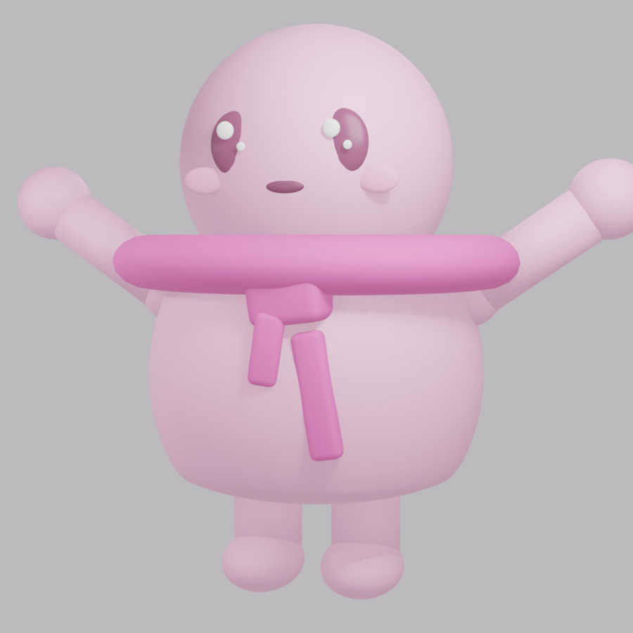
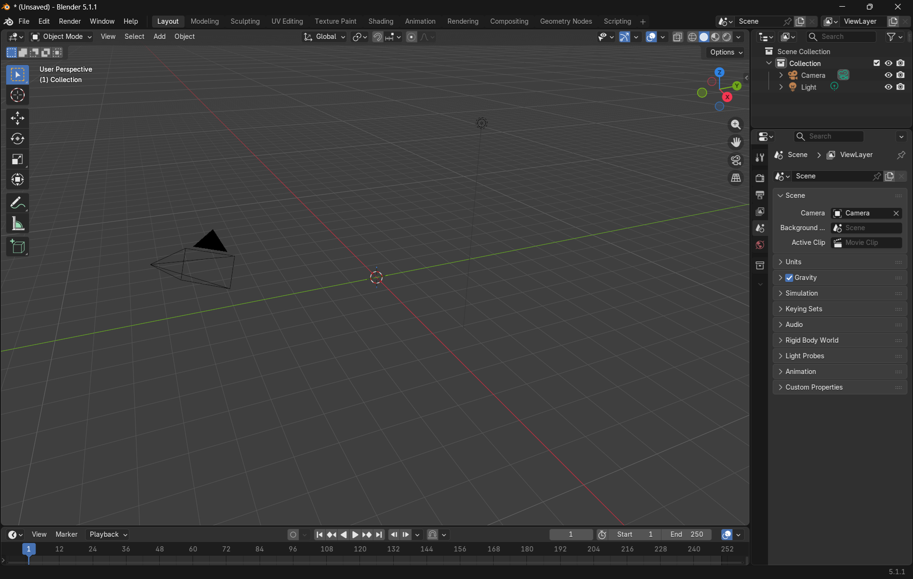
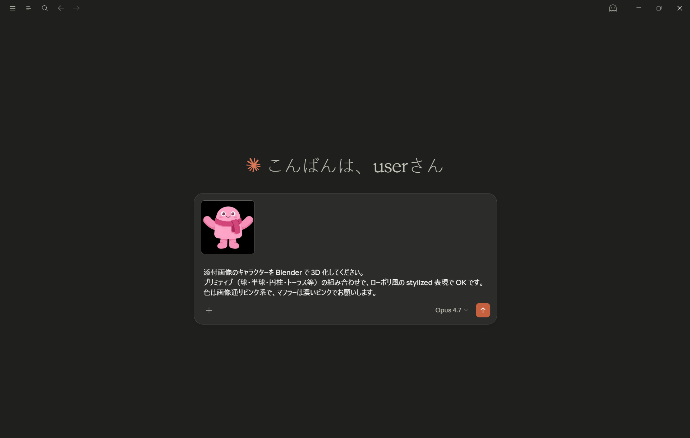
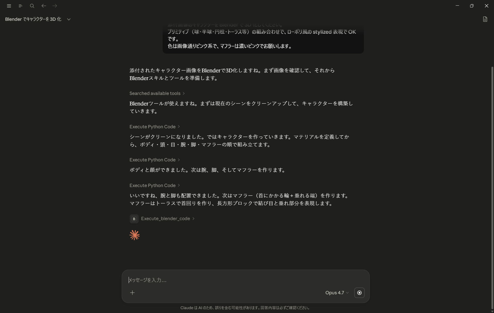
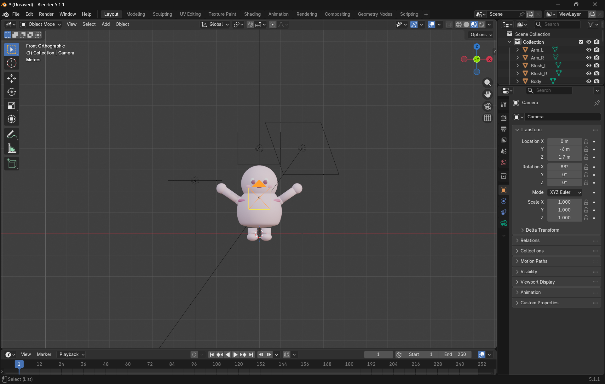
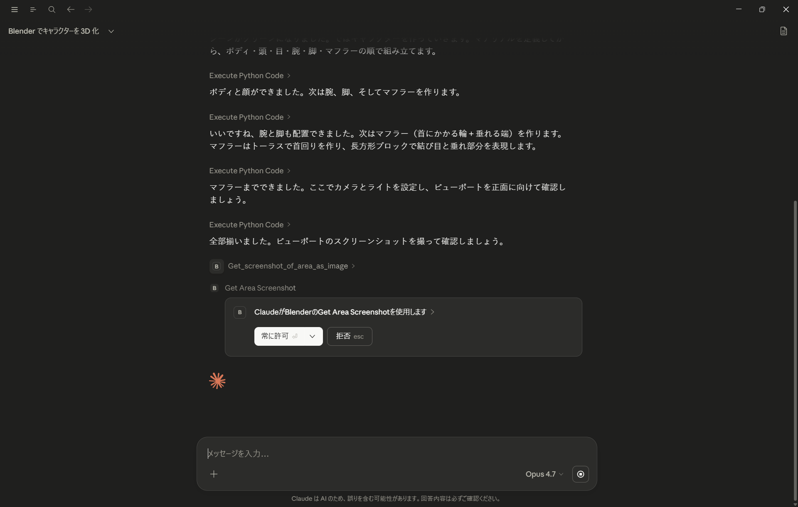
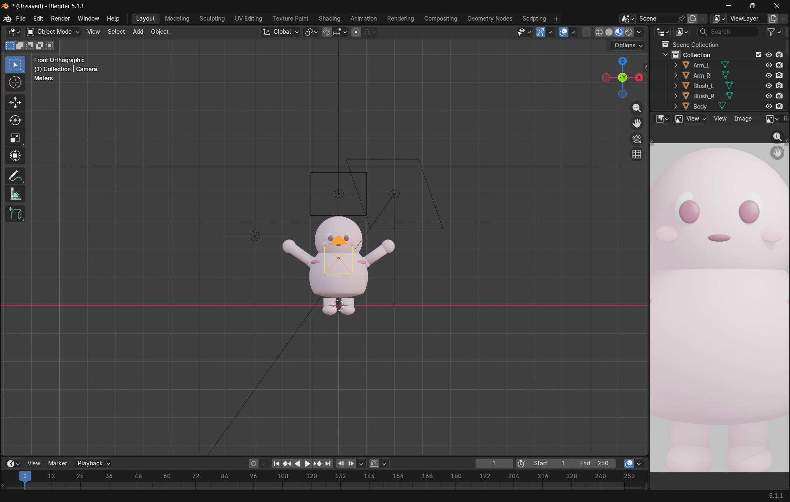
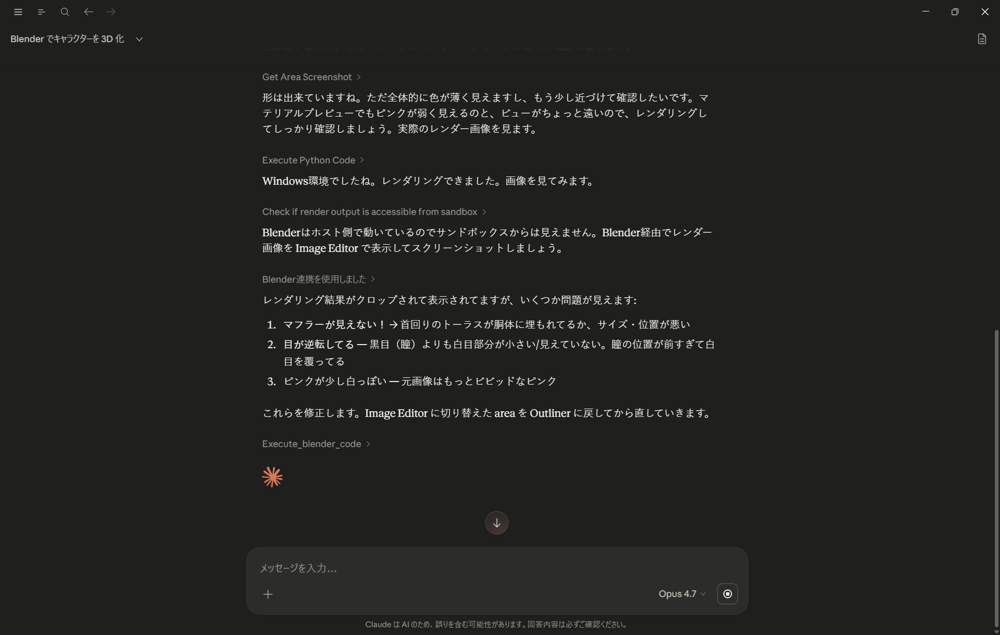
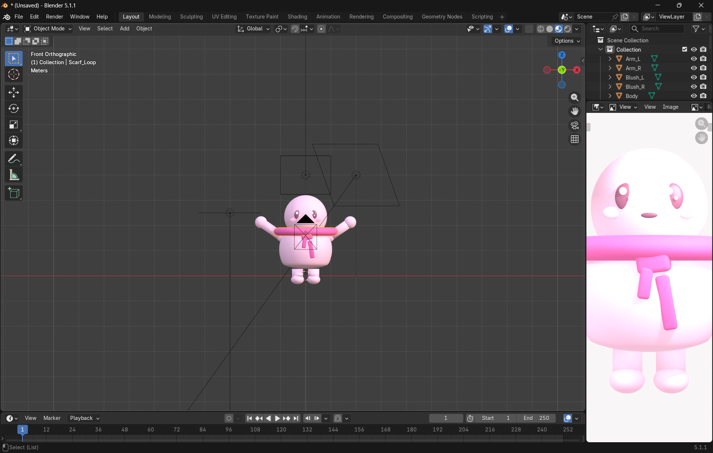
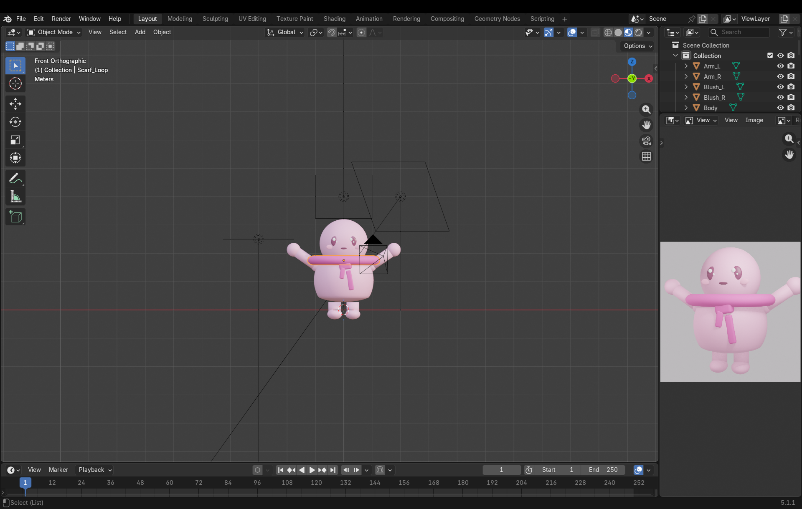

# claude-meets-blender

Anthropic が 2026-04-28 に発表した [Claude for Creative Work](https://www.anthropic.com/news/claude-for-creative-work) の Blender connector を実際に試した記録

**Claude の無料プランでも動いた**ので追加コストゼロ。3D 触ったことない人間が、自然言語だけで Blender をどこまで動かせるかの実験

## 結果：自作キャラの 3D 化

自分の Web サービス [Swipe Ocean](https://swipeocean.surf/about?l=ja) のキャラ「Harmonizer」を Claude に渡して「3D 化して」と頼んだ結果

| 元 2D | Claude が作った 3D |
|---|---|
|  |  |

自分の操作は **画像添付 → 日本語プロンプト送信 → ツール許可ボタン 1 回**だけ。あとは Claude が Blender を Python で叩いて、途中で**自分でスクショを撮って自分で確認・修正**しながら 20 分で完成

3D 経験ゼロの人間が自然言語だけでここまで作れる、という事実が一番の収穫

## 実験の流れ

### 入力

事前に「Blender に赤い立方体を 1 つ追加して」で疎通確認 → 通ったので本番

開始時の Blender はクリーンな空シーン（Camera + Light のみ）



Claude Desktop の Chat に `inputs/harmonizer.png` を添付して、以下のプロンプト

```
添付画像のキャラクターを Blender で 3D 化してください。
プリミティブ（球・半球・円柱・トーラス等）の組み合わせで、ローポリ風の stylized 表現で OK です。
色は画像通りピンク系で、マフラーは濃いピンクでお願いします。
```



### Claude が自分で立てた段取り

順序の指示は一切してないが、Claude が自分でパーツを 6 段階に分けて宣言

1. ボディ（ドーム）
2. 頭
3. 目
4. 腕
5. 脚
6. マフラー（トーラス + 垂れ端の長方形）

各ステップで `Execute Python Code` ツールを呼んで bpy で生成



全パーツ揃った段階（まだ灰色）



### ハイライト：AI が自分でスクショ撮って自分で直す

ここからが今回の体験の真骨頂

形を組み終わると Claude は何も指示してないのに自発的に宣言

> 全部揃いました。ビューポートのスクリーンショットを撮って確認しましょう。

そして `Get Area Screenshot` ツールを呼ぶ。出てくる許可ダイアログ



撮ったスクショは Blender の Image Editor に表示（右パネル）



これを見て Claude が「色が薄い」「ビューが遠い」と判定 → レンダリングして再確認 → さらに**3 つの具体的なバグまで自分で特定**

> 1. マフラーが見えない！→ 首回りのトーラスが胴体に埋もれてるか、サイズ・位置が悪い
> 2. 目が逆転してる → 黒目（瞳）よりも白目部分が小さい/見えていない。瞳の位置が前すぎて白目を覆ってる
> 3. ピンクが少し白っぽい → 元画像はもっとビビッドなピンク



「指示通りに動く AI」じゃなくて「自分の出力を見て自分でやり直す AI」の実例。MCP の `Get Area Screenshot` ツールがあることで、テキストだけのやりとりじゃ実現できない自己修正 loop が成立

### 完成

色を濃くして再レンダー（途中、まだマフラーが崩れたまま）



最終結果（900×900 でレンダリング）


Blender 上の作業画面。Outliner にパーツが整然と並ぶ



### 数字で見る今回

| 項目 | 値 |
|---|---|
| 所要時間 | 約 20 分 |
| 最終パーツ数 | 23 |
| 自分の操作 | 画像添付・プロンプト送信・「常に許可」ボタン 1 回 |
| Blender に対する直接操作 | 0 |

## 学び

- **画像 + 「ローポリ風 stylized 表現で」レベルの軽い指示でちゃんと形が出る**。「マフラーは濃いピンクで」と指定しても初回は薄めに出るので、結局「もっと鮮やかに」を添えるリトライ前提
- **AI が自分でスクショ撮って自分でバグ特定する loop**が今回の最大ハイライト。MCP の本領
- 完璧に元キャラを再現するわけではない（簡略化される）。「キャラのテイストを 3D で起こす」用途には十分

## ハマりポイント

| 罠 | 解決 |
|---|---|
| サイドパネル（N キー）に BlenderMCP タブが出ない | 公式版は Preferences > Add-ons > MCP の中に UI、コミュニティ版（ahujasid）と違う |
| 立方体作っても画面に何も出ない | デフォルト Cube と新規 Cube が同じ (0,0,0) で重なってる。Outliner を確認 |
| 立方体の色が赤に見えない | Solid モード表示はマテリアル色を出さない。**Z キー → Material Preview** に切り替え |
| add-on ドロップで「unknown repository」 | lab.blender.org がデフォルト信頼リポジトリじゃない。Add Repository で追加（一度きり） |

## セットアップ

実際にやって動いた構成ベースの手順

### 必要なもの（全部無料）

| 項目 | 確認方法 |
|---|---|
| Claude Desktop（Free プラン以上） | https://claude.ai/download |
| Blender 5.1+（公式は 4.2+ と書いてるが add-on の要件は 5.1+） | https://www.blender.org/download/ |

### 1. Blender 5.1+ をインストール

公式から OS に合うものを DL → インストール

### 2. Claude Desktop で Blender connector を追加

1. Claude Desktop を起動
2. 設定（左下のプロフィールアイコン）→ **コネクタ**
3. **コネクタを参照** → ディレクトリ画面
4. 検索欄に **"Blender"** → 公式 connector（Anthropic & パートナー）
5. **+** → **インストール**
6. 「有効」になれば完了

### 3. Blender に Blender Lab の MCP add-on をインストール

1. ブラウザで https://www.blender.org/lab/mcp-server/ を開く
2. ページ内の **「Drag and Drop into Blender」** ボタンを Blender ウィンドウへドラッグ
3. 「Allow Online Access」が必要なので有効化（Preferences > System > Network > Allow Online Access ✓）
4. 再度ドラッグ → 「unknown repository」確認 → **Add Repository...** で `lab.blender.org` を信頼追加（Create）
5. もう一度ドラッグ → 「Install Extension: MCP」ダイアログ → **OK**（Enable Add-on ✓）

### 4. MCP サーバーが動いてることを確認

1. Edit > Preferences > Add-ons → 検索 **"MCP"**
2. MCP add-on の **「>」** で詳細展開
3. 一番下の状態が **「Server is running ✓」** なら OK
   （Auto Start が初期で ON なので、有効化と同時に自動起動してるはず）

> 注意: 公式版 MCP は **N サイドパネルに出ない**。コミュニティ版（ahujasid）と UI パターンが違う。**Preferences の add-on 詳細内に UI**

### 5. Claude Desktop で動作確認

1. Chat（Code でも Cowork でもなく Chat）で新規チャットを開く
2. プロンプト

   ```
   Blender に赤い立方体を1つ追加して
   ```

3. Tool 使用許可ダイアログ「Claude が Blender の Execute Python Code を使用します」→ **常に許可**
4. → Blender の Outliner に **RedCube** が出現

## セキュリティ警告

公式の MCP Server ページに記載

> The MCP server will execute LLM generated code in Blender without any guards in place to protect your data from removal or being sent to a remote location.

→ MCP server は LLM が生成したコードをガードなしで Blender 内で実行。重要データのある PC では使わないか、別 PC / VM 推奨

## ソース

- [Claude for Creative Work - Anthropic](https://www.anthropic.com/news/claude-for-creative-work)
- [MCP Server - Blender Lab](https://www.blender.org/lab/mcp-server/)
- [Using the Blender Connector in Claude](https://claude.com/resources/tutorials/using-the-blender-connector-in-claude)
